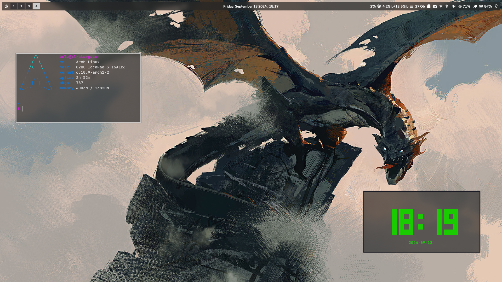

# ZL-Stargazer

### Description

My first "from scratch" hyprland rice.

**Version**: 01

### Programs used

- Hyprland
- Hyprlock
- Hyprpaper
- Hypridle
- Waybar
- Wofi
- Wlogout
- Kitty
- Swaync
> Power profiles needed for waybar module

> grim, slurp and swappy needed for taking screenshots

### Other

- **GTK-THEME**: Fluent-Green-Dark
- **ICON THEME**: Papirus-Green-Dark
- **FILE MANAGER**: Thunar
- **THEMER**: nwg-look
- **SHELL**: zsh

> Wallpaper included in config directory

> You may need to change lock screen user icon path in .config/hypr/hyprlock

### Photos

